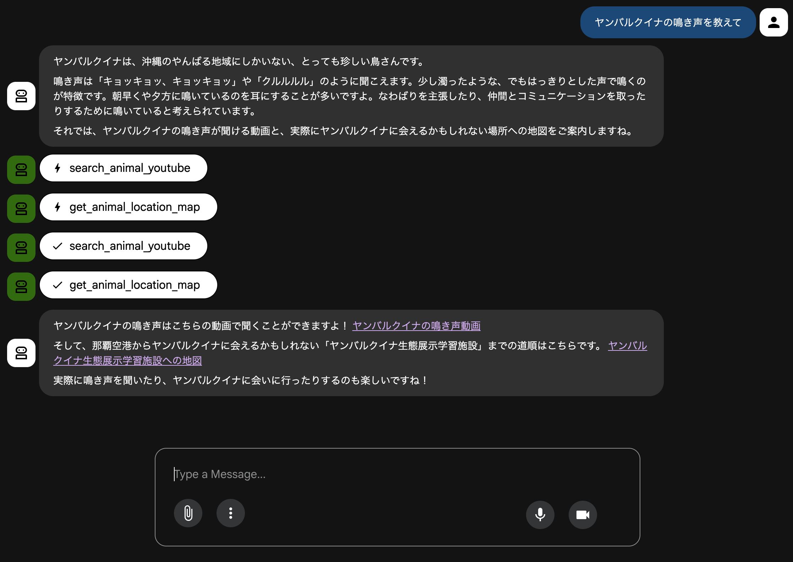
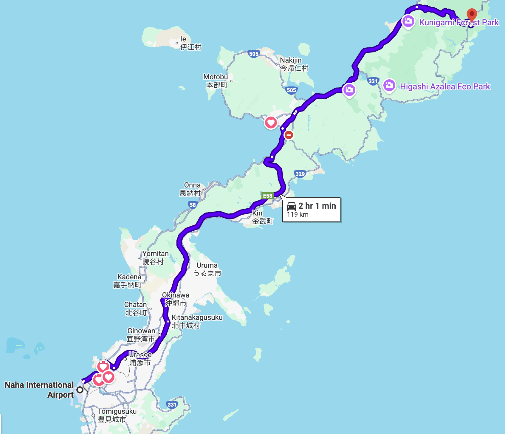

# agent-animal-voice

## 実行方法
ターミナルより以下のコマンドを実行します。
```
git clone https://github.com/your-username/agent-animal-voice.git
curl -LsSf https://astral.sh/uv/install.sh | sh
export PATH="$HOME/.local/bin:$PATH"
uv venv -p 3.13
source .venv/bin/activate
uv sync
cp animal_voice_agent/.env.example animal_voice_agent/.env
echo "GOOGLE_API_KEY=your_google_api_key" >> animal_voice_agent/.env
adk web
```

http://127.0.0.1:8000　にアクセスして動作確認します。

inputのフォームに質問を入力します。

Agentがtoolの使用の有無も含めて思考し、回答を返します。



以下のようにgoogle mapのリンクやYouTubeのリンクも返します。




## adkエージェントの作り方

以下はadkエージェントの作り方のメモです。

参考：
- repository: https://github.com/google/adk-python　
- tutorial: https://codelabs.developers.google.com/your-first-agent-with-adk#0
- adk web: https://docs.cloud.google.com/agent-builder/agent-engine/sessions/manage-sessions-adk
- tool: https://google.github.io/adk-docs/tools/built-in-tools/
- adk web: https://github.com/google/adk-web
- adk examples: https://github.com/google/adk-samples

### uv のインストール
pythonのライブラリ管理ツールuvをインストールをします。
```
curl -LsSf https://astral.sh/uv/install.sh | sh
export PATH="$HOME/.local/bin:$PATH"
```

### uv の仮想環境作成
プロジェクトのルートディレクトリで以下のコマンドを実行します。
```
uv init -p 3.13
source .venv/bin/activate
uv add python-dotenv google-adk
```

uv initで仮想環境とproject.tomlが作成されます。

仮想環境のフォルダはデフォルトで.venvになります。

またオプションでpythonのバージョンを指定できます。

### エージェント作成

adk webを使ってエージェントを作成するため、ルートディレクトリの配下に{agent_name}というフォルダを作成します。

その中にagent.pyを作成し、エージェントのコードを書きます。

> Run this command from the parent directory that contains your my_agent/ folder. For example, if your agent is inside agents/my_agent/, run adk web from the agents/ directory.
https://google.github.io/adk-docs/get-started/python/#run-with-web-interface


#### エージェント作成ファイルのフォルダ構成例
adkを使ったエージェントのフォルダ構成例は以下の通り。

サブエージェントは必要に応じて追加します。

```
{project_name}/
 ├── {agent_name}/
 │    ├── sub_agents/
 │    │    ├── {sub_agent1}.py　# サブエージェントがある場合
 │    │    └── ...
 │    ├── .env　# 環境変数ファイル
 │    ├──  agent.py　# エージェント定義ファイル
 │    └── tools.py　# ツール定義ファイル
 ├── project.toml　# uvのプロジェクト設定ファイル
 └── .venv/　# uvの仮想環境フォルダ
```

#### agent.py
agent.pyにはエージェントの定義を書きます。

LlmAgentクラスをインスタンス化し、root_agentに代入することでエージェントが作成されます。

ここを`root_agent`にしないと` No root_agent found`というエラーになりました。
```
from google.adk.agents import LlmAgent
root_agent = LlmAgent(
        model=LLM_MODEL_ID, # gemini-2.5-flash etc
        name=AGENT_NAME, # 任意のエージェント名
        description=AGENT_DESCRIPTION, # 簡単なエージェントの説明
        instruction=AGENT_INSTRUCTION, # エージェントの詳細な指示
        tools=[TOOLS],　# 使用するツールのリスト
    )
```

ドキュメントには`Agent`や`LlmAgent`とクラス名が出てくるが、AgentはLlmAgentのエイリアスで、どちらもで良いみたいです。

> The LlmAgent (often aliased simply as Agent) 
https://google.github.io/adk-docs/agents/llm-agents/


#### tools.py
tools.pyにはエージェントが使用するtoolを定義します。
toolとは、エージェントが外部の情報を取得したり、アクションを実行したりするための機能です。

toolの書き方として、２つの方法があります。
1. 既に用意されれている、Built-in toolsを使う(例：Search tool)
2. 自分で関数を定義した、Custom toolsを作成する

https://google.github.io/adk-docs/tools/

### エージェントの実行

adkの場合、UIはadk webコマンドで起動します。

```
adk web
```

実行場所は、agentフォルダの親ディレクトリで実行します。

> Run it from the parent directory that contains your agent folder

